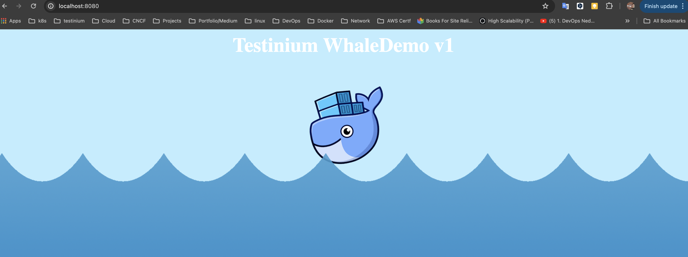

# docker-whale

for Docker

Build me: `docker build -t whale-example .`

Run me : `docker run -p8080:80 whale-example`

```
localhost:8080
```

for K8S

Build me: `docker build -t whale-example .`

```
kubectl run whale-deployment --image whale-example 
kubectl expose deployment whale-deployment --port 8080 --target-port 80 
kubectl port-forward deployment/whale-deployment 8080:80
```



